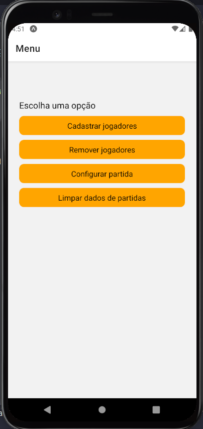
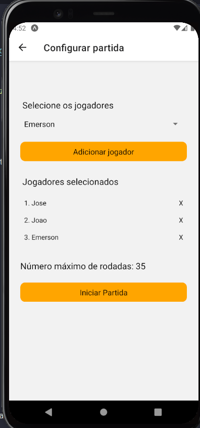
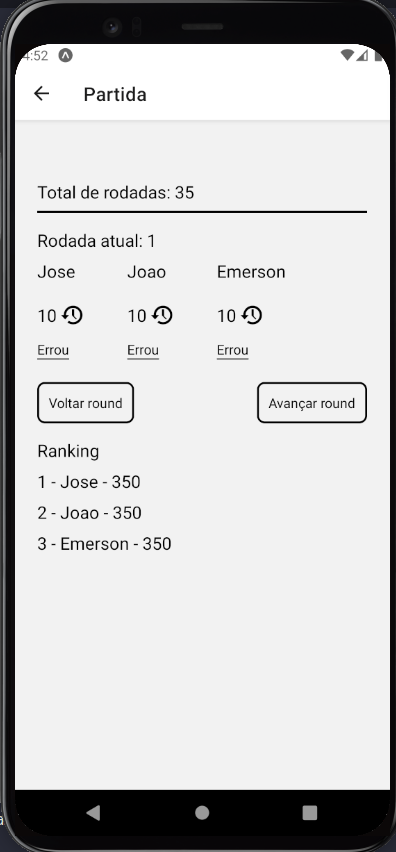

# Previsão - Prevision






> Esse app tem como objetivo anotar a pontuação durante o jogo de baralho Previsão. Para que isso seja feito é preciso: adicionar os jogadores na memória do celular (Cadastrar jogadores), adicionar os jogadores na partida (Configurar partida), avança cada rodada para anotar a pontuação (Iniciar partida)

## 🚀 Build <prevision>

Android:

```
expo build:android
```

Como alternativa, consulte a documentação do GitHub em [como criar uma solicitação pull](https://help.github.com/en/github/collaborating-with-issues-and-pull-requests/creating-a-pull-request).
